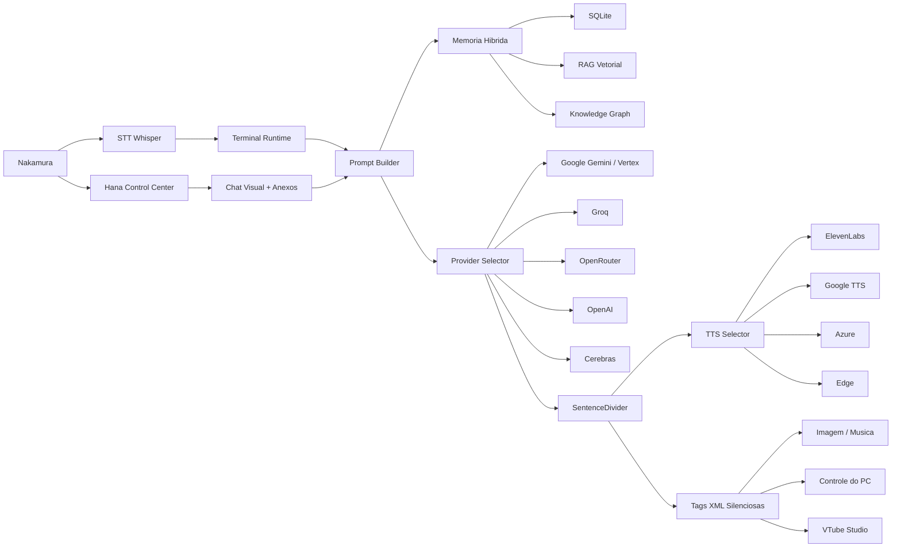

<div align="center">
  

  <h1>HanaNakamura-VTuber-OSS</h1>
  <p>
    <strong>Assistente VTuber desktop-first com voz, memoria, GUI, ferramentas XML, geracao de midia e integracao Live2D.</strong>
  </p>

  <p>
    
    
    
    
  </p>

  <p>
    <a href="#visao-geral">Visao geral</a> ·
    <a href="#showcase-da-hana">Showcase</a> ·
    <a href="#arquitetura">Arquitetura</a> ·
    <a href="#instalacao">Instalacao</a> ·
    <a href="#roadmap">Roadmap</a>
  </p>
</div>

---

## Visao Geral

**Hana AM Nakamura** e uma assistente VTuber feita para rodar no desktop do Windows, conversar por voz, lembrar contexto, controlar ferramentas locais e funcionar como uma personagem viva em volta do seu PC.

O projeto nao e so um chatbot: ele combina runtime de voz, painel GUI, memoria hibrida, geracao de imagem/musica, analise de arquivos, controle do PC por tags XML, VTube Studio e multiplos providers de LLM/TTS.

> O terminal e o modo "ao vivo": respostas curtas, falaveis e economicas para TTS.
> A GUI e o modo "chat completo": respostas maiores, anexos, markdown, arquivos e midia inline.

---

## Showcase Da Hana

<table>
  <tr>
    <td align="center" width="25%">
      <br>
      <sub><b>Hana VTuber</b></sub>
    </td>
    <td align="center" width="25%">
      <br>
      <sub><b>Close-up / expressao</b></sub>
    </td>
    <td align="center" width="25%">
      <br>
      <sub><b>Arte de personagem</b></sub>
    </td>
    <td align="center" width="25%">
      <br>
      <sub><b>Visual anime</b></sub>
    </td>
  </tr>
</table>

---

## O Que Ela Faz

| Area | Recursos |
| --- | --- |
| Voz | STT por Whisper, TTS por ElevenLabs, Google, Azure, OpenAI e Edge, stop global por F8 |
| Cerebro | Providers `google_cloud`, `groq`, `openrouter`, `openai` e `cerebras` |
| GUI | Control Center em Tauri/React, chat visual, anexos, markdown, cards de audio e preview de midia |
| Memoria | SQLite cronologico, RAG vetorial e grafo de conhecimento |
| Midia | Geracao/edicao de imagem, geracao de musica, analise de video/anexos e historico local |
| Desktop | Tool XML para abrir URL, abrir app, ler arquivo, mover mouse, digitar, volume e processos |
| VTuber | Integracao com VTube Studio, emocoes, parametros, lipsync e estado persistido |

---

## Dois Modos, Dois Contratos

### Terminal Runtime

Arquivo principal: [`main.py`](main.py)

O terminal e o modo de voz real da Hana. Ele escuta o microfone, monta contexto, chama o LLM em streaming, filtra tags silenciosas e fala a resposta por TTS.

**Regra do terminal:** respostas curtas por padrao para evitar fala longa e gasto desnecessario de TTS.

### Hana Control Center

Arquivos principais: [`control_panel/`](control_panel/) e backend FastAPI em [`src/api/server.py`](src/api/server.py)

A GUI Tauri/React e o painel de controle completo. Ela aceita textos grandes, anexos, drag and drop, `Ctrl+V`, arquivos de codigo, imagens, audio, video, PDF e documentos.

**Regra da GUI:** pode responder grande quando fizer sentido, porque funciona como chat visual.

---

## Arquitetura



---

## Modulos Principais

```text
src/
  brain/          pipeline LLM e tools
  config/         persona, prompt e config principal
  core/           profiles, capabilities e prompt builder
  api/            backend FastAPI usado pelo Control Center
  memory/         SQLite, RAG e knowledge graph
  modules/
    media/        jobs de musica
    tools/        inbox e controle do PC
    vision/       visao e geracao de imagem
    voice/        STT, TTS e stop global
  providers/      adapters LLM
  utils/          texto, stream, tags e UI de terminal
control_panel/    frontend Tauri/React
```

---

## Tags XML Silenciosas

A Hana pode falar uma coisa para o usuario e executar outra por baixo, sem vazar comando no TTS.

```xml
<salvar_memoria>O Nakamura prefere respostas curtas no terminal.</salvar_memoria>
<gerar_imagem>anime portrait of Hana with golden hair and white flowers</gerar_imagem>
<gerar_musica>soft dreamy lofi song for sleeping</gerar_musica>
<acao_pc>{"action":"open_url","url":"https://github.com"}</acao_pc>
```

Regras importantes:

- tags XML so valem para o pedido atual;
- acoes antigas nao devem ser repetidas depois de pausa longa;
- `run_command` e operacoes perigosas passam por guardrails;
- o texto dentro das tags nao deve ser falado pelo TTS.

---

## Voz E TTS

Fallback atual:

```text
edge -> elevenlabs -> google -> azure -> openai
```

ElevenLabs suporta configuracao manual pela GUI:

- `voice_id`
- `model_id`
- `rate`
- `stability`
- `similarity_boost`
- `style`
- `speaker_boost`

O hotkey `F8` usa stop global para tentar parar:

- fala do terminal;
- fala do chat da GUI;
- preview de audio;
- musica ou playback iniciado pela Hana.

---

## Memoria

A memoria da Hana usa tres camadas:

| Camada | Funcao |
| --- | --- |
| SQLite | historico cronologico recente |
| RAG | busca semantica por conversas antigas |
| Knowledge Graph | fatos permanentes e relacionamentos |

O terminal tambem recebe contexto temporal: se passou muito tempo desde a ultima fala, a Hana trata a nova mensagem como novo contexto e evita continuar tarefas antigas automaticamente.

---

## Instalacao

### 1. Clone

```bash
git clone https://github.com/NakamuraIA/HanaNakamura-VTuber-OSS.git
cd HanaNakamura-VTuber-OSS
```

### 2. Ambiente virtual

```bash
python -m venv .venv
.venv\Scripts\activate
```

### 3. Dependencias

```bash
pip install -r requirements.txt
```

Dependencias opcionais:

```bash
pip install pyvts pypdf PyPDF2 youtube-transcript-api
```

---

## Variaveis De Ambiente

Guia completo: [`docs/INSTALL.md`](docs/INSTALL.md)

Copie:

```bash
copy .env.example .env
```

Exemplo:

```env
GROQ_API_KEY=sua_chave
GEMINI_API_KEY=sua_chave
OPENROUTER_API_KEY=sua_chave
OPENAI_API_KEY=sua_chave
CEREBRAS_API_KEY=sua_chave
ELEVENLABS_API_KEY=sua_chave
TAVILY_API_KEY=sua_chave
GOOGLE_CLOUD_PROJECT=seu_projeto
GOOGLE_CLOUD_LOCATION=global
```

Nunca commite seu `.env`.

Para o setup minimo, apenas `GROQ_API_KEY` e obrigatoria. O TTS publico default e `edge`, sem chave.

---

## Como Rodar

### Runtime + Control Center

```bash
python main.py
```

### GUI sem terminal visivel

```bash
wscript run_hana_gui_hidden.vbs
```

---

## Configuracao Principal

Arquivo: [`src/config/config.json`](src/config/config.json)

No clone publico, os defaults ficam em [`src/config/config.example.json`](src/config/config.example.json). O arquivo `src/config/config.json` e local e ignorado pelo Git.

Guias detalhados: [`docs/CONFIG.md`](docs/CONFIG.md), [`docs/PROVIDERS.md`](docs/PROVIDERS.md), [`docs/TROUBLESHOOTING.md`](docs/TROUBLESHOOTING.md)

Blocos importantes:

```json
{
  "LLM_PROVIDER": "groq",
  "TTS_PROVIDER": "edge",
  "CHAT": {
    "LLM_PROVIDER": "groq",
    "response_mode": "adaptive",
    "auto_route_media": true
  },
  "GUI": {
    "stop_hotkey_enabled": true,
    "stop_hotkey": "F8"
  }
}
```

---

## Providers

| Provider | Uso |
| --- | --- |
| `google_cloud` | Gemini API, Vertex AI, visao e midia |
| `groq` | respostas rapidas e modelos open |
| `openrouter` | acesso a varios modelos por gateway |
| `openai` | modelos OpenAI diretos |
| `cerebras` | inferencia rapida quando configurado |

O provider Google trabalha em modo:

- `gemini_api`
- `vertex_ai`
- `auto`

---

## VTube Studio

A integracao fica em [`src/modules/vts_controller.py`](src/modules/vts_controller.py).

Ela inclui:

- autenticacao por token;
- heartbeat;
- reconexao;
- leitura de hotkeys;
- expressoes;
- parametros;
- tentativa de lipsync;
- estado salvo em [`data/vts_state.json`](data/vts_state.json).

---

## Hana Inbox

Pasta padrao:

```text
%USERPROFILE%\Desktop\hana_inbox
```

Estrutura:

```text
hana_inbox/
  imagem/
  pdf/
  docs/
  code/
  audio/
  video/
```

A GUI tambem aceita arrastar arquivos direto no chat, entao a inbox e util, mas nao obrigatoria.

---

## Comandos Uteis

```bash
python main.py
python -m compileall main.py src
python -m pytest -q
```

---

## Roadmap

- Melhorar fila visual de midia na GUI.
- Criar painel de historico para imagem e musica.
- Refinar interrupcao por voz com VAD seguro.
- Criar editor visual de memorias.
- Melhorar benchmark de visao desktop.
- Evoluir o modelo Live2D da Hana.
- Criar pipeline de aprovacao para publicar musicas e assets.

---

## Status Honesto

O projeto ja e funcional, mas ainda esta em evolucao rapida.

Pontos fortes:

- desktop-first;
- GUI e terminal separados por contrato;
- memoria hibrida;
- tags XML silenciosas;
- providers multiplos;
- stop global;
- foco real em VTuber e assistente residente.

Limites atuais:

- foco principal em Windows;
- alguns providers exigem chave paga;
- Live2D depende de modelo e parametros corretos;
- algumas automacoes desktop ainda precisam de mais guardrails.

---

## Contribuicao

Contribuicoes devem preservar a separacao entre:

- terminal de voz;
- chat visual da GUI;
- memoria;
- providers;
- TTS;
- tags XML;
- controle do PC.

Se mudar comportamento de prompt, canal ou provider, atualize a documentacao junto.

---

## Licenca

Consulte a licenca do repositorio e os termos dos providers externos usados.

<div align="center">
  
</div>
