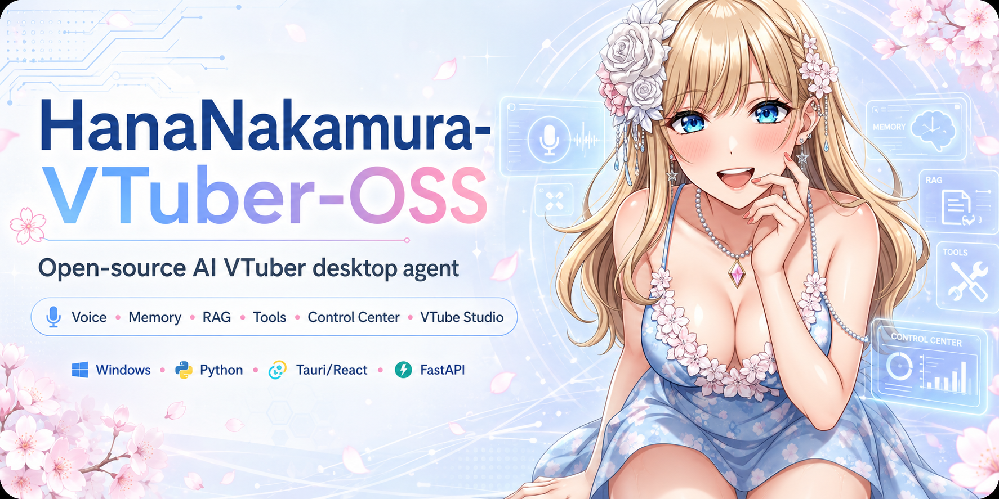

<div align="center">



<br/><br/>

# 🌸 Hana Agent OSS

### Um agente multimodal local. Uma só mente. Infinitas formas.

**Desktop · Código · Mídia · Voz · VTuber · NPC · Orquestrador**
Tudo na _sua_ máquina, sob o _seu_ controle.

<br/>


<br/>

> _"Não é só um VTuber. É um cérebro que pode vestir qualquer corpo."_

</div>

---

## 📑 Índice

- [⚡ O que é isso](#-o-que-é-isso)
- [🧬 No que a Hana pode se transformar](#-no-que-a-hana-pode-se-transformar)
- [🧰 Linguagens & stack](#-linguagens--stack)
- [🚀 Instalação rápida](#-instalação-rápida)
- [▶️ Como usar](#️-como-usar)
- [💡 Dicas](#-dicas)
- [🎭 Criando referências de personagem](#-criando-referências-de-personagem)
- [🗂️ Estrutura do projeto](#️-estrutura-do-projeto)
- [🧠 Backend / Voz / Memória / MCP](#-backend--o-agent-core)
- [🛠️ Checks de desenvolvimento](#️-checks-de-desenvolvimento)
- [📚 Documentação](#-documentação)
- [⚖️ Licença e marca](#️-licença-e-marca)

---

## ⚡ O que é isso?

**Hana Agent OSS** é um framework de agente multimodal **local** construído em volta da
**Hana Operador**.

O projeto **não é mais VTuber-first**. O avatar virou só **uma interface opcional** —
um subagente, uma roupa. O produto de verdade é o **Agent Core**: **um único backend**
que coordena ferramentas, memória, canais, módulos de mídia, provedores MCP e
subagentes especializados.

Você dá uma mente para a Hana. Ela decide que corpo usar.

---

## 🧬 No que a Hana pode se transformar

| 🎭 Forma | O que ela vira |
| --- | --- |
| 🖥️ **Desktop Agent** | Fluxos locais, arquivos e ferramentas de sistema — com portões de permissão. |
| 💻 **Coding Agent** | Navega no projeto, edita, roda testes e faz loops de review. |
| 🎨 **Media Agent** | Imagem, música, áudio, vídeo e pipelines criativos. |
| 🌸 **VTuber Interface** | Avatar, voz e expressões — camada opcional. |
| 🎮 **Game NPC** | Subcérebro especializado plugado nas APIs do jogo. |
| 🧠 **Agent Orchestrator** | Controla servidores MCP e outros agentes externos. |

---

## 🧰 Linguagens & stack

| Camada | Tecnologia |
| --- | --- |
| 🐍 **Backend / Agent Core** | Python 3.11+ · FastAPI · WebSockets · SQLite (+ FTS) |
| ⚛️ **Frontend (Control Panel)** | React · TypeScript · Tailwind · Vite |
| 🦀 **App desktop** | Tauri (Rust) |
| 🎙️ **Voz** | sounddevice · pygame · Silero VAD · Groq Whisper · Edge/ElevenLabs/Gemini TTS |
| 🔗 **Ferramentas externas** | Cliente MCP (Tavily, etc.) |
| 🪟 **Plataforma alvo** | Windows (PowerShell) |

---

## 🚀 Instalação rápida

> **Pré-requisitos:** Python 3.11+ · Node.js LTS · Rust (stable, p/ o app Tauri) · Git

```powershell
# 1. clonar
git clone https://github.com/NakamuraIA/HanaNakamura-VTuber-OSS.git
cd HanaNakamura-VTuber-OSS

# 2. ambiente Python
python -m venv .venv
.\.venv\Scripts\activate
python -m pip install --upgrade pip
pip install -r requirements.txt

# 3. frontend
cd control_panel
npm install
cd ..

# 4. (opcional) voz, mídia, visão, SDKs de provider, busca web
pip install -r requirements-optional.txt

# 5. configurar chaves
copy .env.example .env
```

Preencha no `.env` **só os providers que vai usar**. O backend sobe sem chave, mas pra
chat real precisa de **pelo menos um LLM**:

- `GEMINI_API_KEY` (ou `GOOGLE_API_KEY`)
- `OPENROUTER_API_KEY`
- `GROQ_API_KEY` (também usado pelo STT Whisper)

Detalhes completos em [docs/INSTALL.md](docs/INSTALL.md).

---

## ▶️ Como usar

Sobe a stack local inteira em **um comando**:

```powershell
python main.py
```

- 🔌 Backend → `http://127.0.0.1:8042`
- 🎛️ Control Panel → `http://127.0.0.1:5173` (abre sozinho no navegador)

Outros modos:

```powershell
python main.py backend-only    # só o backend
python main.py frontend-only   # só o painel
python main.py healthcheck     # ver se está vivo
python main.py shutdown        # desligar tudo
```

Depois é só abrir o **Control Panel** e conversar pelo **Chat do Controle**, ou ligar a
voz no **Terminal Agente**.

---

## 💡 Dicas

- 🔑 **Comece simples:** uma chave de LLM já basta pra conversar. Adicione voz/mídia
  depois.
- 🗣️ **Voz local x Discord não rodam juntos** — em máquina fraca dá loop de áudio. Use
  um de cada vez.
- 🎙️ **Sem VAD = sem escuta de sala aberta.** Use **PTT** (push-to-talk) ou o teste
  manual de microfone.
- ⏹️ **Travou a fala?** As hotkeys de parada (F8) interrompem o TTS e devolvem o runtime
  pro modo certo.
- 🔒 **MCP é opt-in:** nenhum servidor liga e nenhuma ferramenta roda sem você colocar
  na allowlist.
- 🧹 **Memória cresce?** O comando **compact** vira eventos recentes em resumos
  persistentes.
- 🌑 **Tema:** o fundo é preto neutro de propósito; o acento é personalizável no painel.
- 🚫 **Nunca commite o `.env`** — ele guarda chaves reais.

---

## 🎭 Criando referências de personagem

Os personagens usam **pastas de personagem** para gerar imagens consistentes. Cada
personagem vive em `data/characters/<nome>/`:

```txt
data/characters/
  meu_personagem/
    character.json     # identidade + prompts + referências
    base.png           # imagem de referência "base"
    alternate.png      # referência "alternate"
```

O `character.json` define quem é o personagem:

```json
{
  "display_name": "Meu Personagem",
  "identity_prompt": "Anime-style character with long hair, blue eyes, floral ornaments...",
  "negative_prompt": "ugly, deformed, bad anatomy",
  "default_references": ["base", "alternate"],
  "reference_images": {
    "base": "base.png",
    "alternate": "alternate.png"
  }
}
```

**Pra criar um personagem novo:**

1. Crie a pasta `data/characters/<seu_nome>/`.
2. Jogue 1–2 imagens de referência dentro.
3. Crie o `character.json` apontando para essas imagens em `reference_images`.
4. Escreva o `identity_prompt` descrevendo a aparência fixa (cabelo, olhos, roupa…).
5. Use `negative_prompt` pra cortar defeitos comuns.
6. Liste em `default_references` quais imagens entram por padrão na geração.

Quanto mais consistentes as referências e o `identity_prompt`, mais o personagem se
mantém igual entre as gerações.

---

## 🗂️ Estrutura do projeto

```txt
HanaNakamura-VTuber-OSS/
├── main.py                  # supervisiona a stack local inteira
├── !Hana_Agent_OSS/         # 🧠 backend: Agent Core, API, tools, memória, registries
│   └── hana_agent_oss/
│       ├── api/             # rotas FastAPI + serviços (por domínio)
│       ├── providers/       # seletor de LLM (Gemini / OpenRouter / Groq)
│       ├── modules/voice/   # STT, TTS, VAD, runtime de voz
│       ├── memory/          # SQLite + FTS + JSONL
│       ├── persona/         # perfil, prompts, comportamento
│       └── tools/           # ferramentas + cliente MCP
├── control_panel/           # 🎛️ frontend React/Tauri
│   ├── src/                 # views, components, models, api
│   └── src-tauri/           # app desktop (Rust)
├── data/
│   ├── characters/          # 🎭 referências de personagem
│   ├── skills/              # skills em markdown
│   └── memory/              # memória persistente
├── docs/                    # 📚 documentação pública
└── tests/                   # testes
```

> A árvore antiga de backend é **legado**. Novas capacidades entram em
> `!Hana_Agent_OSS/` como ferramentas, módulos, integrações, subcérebros, plugins ou
> provedores MCP. O `main.py` é **só supervisor**.

---

## 🧠 Backend — o Agent Core

O backend ativo é `!Hana_Agent_OSS/`. Ele entrega:

- `HanaAgentCore`;
- `AgentRequest`, `AgentResponse` e `AgentEvent` estruturados;
- `ToolCall`, `ToolResult` e `CapabilityManifest`;
- registries para ferramentas, módulos, integrações, subcérebros, plugins e MCP;
- rotas FastAPI para o Control Panel;
- WebSockets para chat, status e streams de emoção;
- um sistema de memória leve;
- cliente MCP com servidores **desligados por padrão** e allowlist por ferramenta.

Comandos estruturados usam o Agent Core determinístico. Turnos de chat normais passam
pelo seletor de provider. Providers LLM ativos: **Gemini API**, **OpenRouter** e
**Groq**. STT e TTS são providers separados.

<details>
<summary>🎙️ <b>Voz, STT e TTS (clique para abrir)</b></summary>

<br/>

Configuração de chat é separada do perfil de runtime do Terminal Agente:

- `/api/config/llm` — cérebro principal + perfil de TTS do Chat do Controle.
- `/api/config/chat` — provider/modelo/native-search padrão do chat.
- `/api/config/voice` — STT/TTS provider, modelo, voz e microfone do Terminal Agente.
- `/api/config/conexoes` — liga/desliga STT/TTS/VAD/PTT/hotkeys globalmente.
- `/api/voice/stt/transcribe` — upload STT do Groq Whisper atual.
- `/api/voice/tts/synthesize` — síntese TTS do backend.
- `/api/voice/tts/speak` — fala texto com o TTS selecionado.
- `/api/voice/runtime/{start,stop,configure,status,interrupt}` — runtime de voz.
- `/api/terminal-agent/tts/stop` e `/api/voice/tts/stop` — contrato "parar fala".

STT inicial: `groq_whisper` (`GROQ_API_KEY`, `whisper-large-v3`). Captura o microfone
via `sounddevice`, usa um gate RMS/VAD, manda a fala finalizada pro Groq, roteia o
transcript pro LLM e loga tudo no Terminal Agente.

TTS sem chave: `edge` (falado localmente via `pygame`). TTS cloud: `gemini_tts`,
`google_cloud_tts`, `azure`, `cartesia`, `minimax` e `elevenlabs`. Respostas Edge
longas usam streaming — o playback começa enquanto o áudio ainda chega. `ttsVolume`
controla o volume local sem mudar a síntese.

Sem VAD, só entra áudio por PTT ou teste manual. PTT usa um gate mais leve, então
frases curtas passam e o silêncio fica fora do Groq.

</details>

<details>
<summary>💾 <b>Memória</b></summary>

<br/>

- 🗄️ **SQLite** — notas, fatos e settings persistentes.
- 🔍 **SQLite FTS** — busca leve estilo RAG.
- 📜 **JSONL** — eventos de runtime recentes.
- 🧹 **compact** — transforma eventos recentes em resumos persistentes.

</details>

<details>
<summary>🔗 <b>MCP</b></summary>

<br/>

A Hana se conecta a servidores MCP externos como **cliente**. Configuração em
`!Hana_Agent_OSS/runtime/mcp_servers.local.json` ou via `HANA_MCP_CONFIG`.

> 🔒 **Nenhum servidor liga por padrão. Nenhuma ferramenta roda sem allowlist.**

Veja [docs/MCP.md](docs/MCP.md).

</details>

---

## 🛠️ Checks de desenvolvimento

```powershell
python -m compileall main.py !Hana_Agent_OSS/src
pytest -q
cd control_panel
npm run build
cd src-tauri
cargo check
```

---

## 📚 Documentação

| 📄 Doc | |
| --- | --- |
| [Architecture](docs/ARCHITECTURE.md) | Visão geral do sistema |
| [Agent Core](docs/AGENT_CORE.md) | O coração |
| [Modules and Capabilities](docs/MODULES.md) | O que ela sabe fazer |
| [MCP Client](docs/MCP.md) | Conexão externa |
| [Installation](docs/INSTALL.md) | Do zero ao boot |
| [Configuration](docs/CONFIG.md) | Todos os knobs |
| [Providers](docs/PROVIDERS.md) | LLM / STT / TTS |
| [Troubleshooting](docs/TROUBLESHOOTING.md) | Quando der ruim |
| [Release Checklist](docs/RELEASE_CHECKLIST.md) | Antes de publicar |
| [Control Panel](control_panel/README.md) | O frontend |

---

## ⚖️ Licença e marca

O código-fonte é licenciado sob **AGPL-3.0-only**. Veja [LICENSE](LICENSE).

A identidade **Hana Operador**, a marca oficial, os assets do personagem e a mídia
promocional oficial são protegidos separadamente pela política de marca do projeto.
Veja [NOTICE](NOTICE), [TRADEMARK.md](TRADEMARK.md) e
[assets/LICENSE.md](assets/LICENSE.md).

---

<div align="center">

  <h2>⭐ Star History</h2>

  <a href="https://star-history.com/#NakamuraIA/HanaNakamura-VTuber-OSS&Date">
    <picture>
      <source media="(prefers-color-scheme: dark)" srcset="https://api.star-history.com/svg?repos=NakamuraIA/HanaNakamura-VTuber-OSS&type=Date&theme=dark" />
      <source media="(prefers-color-scheme: light)" srcset="https://api.star-history.com/svg?repos=NakamuraIA/HanaNakamura-VTuber-OSS&type=Date" />
      
    </picture>
  </a>

  <br><br>

  

  <br/><br/>

  **🌸 Feita com cuidado, rodando em casa. 🌸**

</div>
